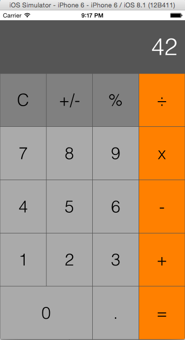

## A Calculator

This is a clone of the iOS Calculator app, written as an exercise in Swift.

#### Task Tracking

Tasks on this project were tracked using [Trello](https://trello.com/b/oizxQjtm/swiftcalculator-task-tracking). My approach shifted as I went along. I added comments to some cards, but focused more on commenting my code to explain my approach.

#### Things I didn't get to

- Having display label adjust font size dynamically to dealing with really long numbers in the display
- Having clear button adjust based on state of calculator (C vs. AC)

#### App Screenshot

